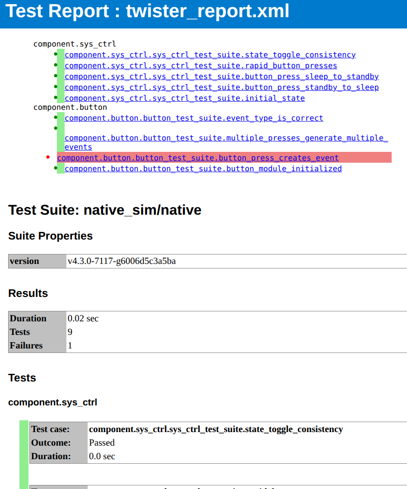

Example APP
###########

**Link to Source:** `app <https://github.com/jonas-rem/zephyr-workshop/tree/main/app>`_

Overview
********

This application demonstrates a simple state machine controlled by a button.
When the button is pressed, the system toggles between two states:

- **Sleep**: LED is off, system waits for events (blocking)
- **Standby**: LED blinks continuously (50ms on, 500ms off)

The application showcases a modular design with inter-component communication via
`ZBus <https://docs.zephyrproject.org/latest/services/zbus/index.html>`_, allowing the Button component to notify the LED component of state
changes without direct coupling. This decoupled architecture enables testing
individual components in isolation.

This application is useful for:

- Understanding modular architecture in Zephyr
- Learning about ZBus for inter-component communication
- Using `Zephyr System Initialization`_ (SYS_INIT) for application
  initialization
- Testing with `native_sim Board`_ and `Twister`_

Architecture
************

The application follows a modular design where functionality is organized into
reusable components. The source code is located in the ``app/src/`` directory,
with a clear separation between common infrastructure and feature-specific
components.

The ``app/common/`` directory contains shared components like message channels
that enable inter-component communication, while the ``app/components/`` directory
contains the individual functional units. Each component is self-contained with its
own source files, build configuration, and Kconfig options.

.. code-block:: text

   app
   ├── CMakeLists.txt
   ├── Kconfig
   ├── prj.conf
   ├── README.rst
   ├── sample.yaml
   ├── src
   │   ├── common
   │   │   ├── CMakeLists.txt
   │   │   ├── message_channel.c
   │   │   └── message_channel.h
   │   ├── main.c
   │   └── components
   │       ├── button
   │       │   ├── button.c
   │       │   ├── CMakeLists.txt
   │       │   └── Kconfig.button
   │       ├── led
   │       │   ├── CMakeLists.txt
   │       │   ├── Kconfig.led
   │       │   └── led.c
   │       ├── sys_ctrl
   │       │   ├── CMakeLists.txt
   │       │   ├── Kconfig.sys_ctrl
   │       │   └── sys_ctrl.c
   └── test_cfg
       ├── button_module.conf
       ├── led_module.conf
       └── sys_ctrl_module.conf

The ``tree`` shows a simplified view of the structure of the application.

Initialization using SYS_INIT
=============================

The application's components are initialized independently of the ``main()``
function using the ``SYS_INIT`` macro. This allows components to inject their
initialization routines into the OS boot sequence automatically.

Each component uses ``SYS_INIT()`` with ``APPLICATION`` priority to register itself
after drivers and ZBus are operational.

This initialization pattern ensures:

- Components start automatically without explicit calls from ``main()``
- Dependencies (drivers, ZBus) are ready before component initialization
- ``main.c`` remains a lightweight placeholder, decoupled from application logic
- Each component can be tested in isolation by simply including it via Kconfig

Each component has its own priority configuration option that defaults to a numeric
value (e.g., ``CONFIG_SYS_CTRL_MODULE_INIT_PRIORITY=85``) to control
initialization order. The entry with the lowest number will be started first.

Example from ``Kconfig.sys_ctrl``:

.. code-block:: kconfig

   config SYS_CTRL_MODULE_INIT_PRIORITY
       int "System control component init priority"
       default 85
       help
         System initialization priority for the system control component.
         This determines the order in which the component is initialized.

The ``APPLICATION`` level ensures proper ordering relative to driver
initialization while allowing custom priorities within the application phase.
Example from ``sys_ctrl.c``:

.. code-block:: c

   SYS_INIT(sys_ctrl_init, APPLICATION, CONFIG_SYS_CTRL_MODULE_INIT_PRIORITY);

Initialization sequence (`Zephyr System Initialization`_)

1. **SYS_INIT components** (priority order):

   - Button (priority 80)
   - Button Mock (priority 80)
   - System Control (priority 85)

2. **led component thread with prio -2**:

   - LED component thread

3. **main thread with Prio -1**

   - Empty in our case (except one log msg)

Boot log showing this order:

.. code-block:: console

   *** Booting Zephyr OS build v4.3.0 ***
   <inf> button_module: Set up button at gpio_emul pin 1
   <inf> button_module: Button module started
   <inf> button_mock: Button mock module initialized
   <inf> sys_ctrl: Button module started
   <inf> led_module: LED module started
   <dbg> led_module: led_fn: LED off
   <inf> app: System booted. Main thread going to sleep.
   <dbg> led_module: led_fn: LED on
   <dbg> led_module: led_fn: LED off

System States
=============

The application implements two system states:

- **Sleep** (``SYS_SLEEP``): LED is off, system waits for events
- **Standby** (``SYS_STANDBY``): LED blinks, system is active

Button presses toggle between these states via ZBus messages.

Component Configuration
=======================

Each component can be independently enabled or disabled via Kconfig options.
example from ``app/prj.conf``:

.. code-block:: kconfig

   # Enable components
   CONFIG_LED_MODULE=y
   CONFIG_BUTTON_MODULE=y
   CONFIG_SYS_CTRL_MODULE=y

Additionally, each component provides optional shell commands that can be activated
per component. These shell commands can be used for testing the components in isolation
or within the application.

.. code-block:: kconfig

   # Control individual module shell configurations
   CONFIG_BUTTON_MODULE_SHELL=y
   CONFIG_LED_MODULE_SHELL=y
   CONFIG_SYS_CTRL_MODULE_SHELL=y

And the same works for Logging. Log levels can be set individually for each
component.

.. code-block:: kconfig

   # Enable debug logging for each module
   CONFIG_LED_MODULE_LOG_LEVEL_DBG=y
   CONFIG_BUTTON_MODULE_LOG_LEVEL_DBG=y
   CONFIG_SYS_CTRL_MODULE_LOG_LEVEL_DBG=y

These options allow building the application with any combination of components,
enabling testing in isolation or creating minimal builds. If features like e.g.
shell commands are not activated they will not be compiled into the binary.

Component Communication
=======================

Components communicate via ZBus channels:

- ``button_ch``: Button press events (publisher: Button component, subscriber: Main app)
- ``led_ch``: LED state changes (publisher: Main app, subscriber: LED component)

Hardware Abstraction
====================

On native_sim, the application uses:

- **GPIO Emulator** (zephyr,gpio-emul) for button and LED
- **PTY UART** for shell on separate console
- **Devicetree Overlay** to define button alias and UART configuration

The overlay file (``boards/native_sim.overlay``) defines:

- ``sw0`` alias for the button
- ``uart1`` enabled for shell
- Shell UART mapped to ``zephyr,shell-uart``

Build/Run
*********

The ``native_sim`` board allows Zephyr applications to be compiled as native
Linux executables, enabling development and testing without physical hardware.

Build the application for native_sim:

.. code-block:: console

   host:~$ west build -b native_sim app -p

Run the application with shell on a separate UART/console:

.. code-block:: console

   host:~$ ./build/zephyr/zephyr.exe -uart_1_attach_uart_cmd='ln -sf %s /tmp/zephyr_shell'

When you run the application, it creates two pseudo-terminals (PTYs):

- **uart_0** (/dev/pts/X) - Main console (logs and shell if not redirected)
- **uart_1** (/dev/pts/Y) - Shell console when using ``-uart_1_attach_uart_cmd``

With the ``-uart_1_attach_uart_cmd`` option, the shell UART is redirected to a
separate PTY and linked to ``/tmp/zephyr_shell``. The main UART output (logs)
remains on the terminal where you started the application, check `native_sim
PTY UART`_ to get more information.

Connect to the shell using:

.. code-block:: console

   host:~$ tio /tmp/zephyr_shell

Sample Output
=============

Main console (stdout):

.. code-block:: console

   *** Booting Zephyr OS build v4.3.0 ***
   <inf> button_module: Set up button at gpio_emul pin 1
   <inf> button_module: Button module started
   <inf> button_mock: Button mock module initialized
   <inf> sys_ctrl: Button module started
   <inf> led_module: LED module started
   <dbg> led_module: led_fn: LED off
   <inf> app: System booted. Main thread going to sleep.
   <dbg> led_module: led_fn: LED on
   <dbg> led_module: led_fn: LED off

Shell via ``/tmp/zephyr_shell``:

.. code-block:: console

   host:~$ tio /tmp/zephyr_shell

     button       clear        date         device       devmem       help
     history      kernel       led          mock_button  rem          resize
     retval       shell        sysctrl
   uart:~$

You can now interact with the shell in one terminal and observe the logging
output of the application in another.

Exit native_sim by pressing :kbd:`CTRL+C`.

Build for a board
=================
To build for the reel_board (e.g., ``reel_board@2``), use:

.. code-block:: console

   host:~$ west build -b reel_board@2 app -p
   host:~$ west flash

Shell Commands
**************

When the application is built with shell support, each component provides commands
for testing and debugging. These commands are available when the corresponding
``CONFIG_*_MODULE_SHELL`` option is enabled.

Button Component Commands
=========================

The button component provides commands for testing button functionality:

.. code-block:: console

   uart:~$ button press    # Simulate a button press event via ZBus

**Button Press** publishes a ``SYS_BUTTON_PRESSED`` event to the button channel,
which triggers the same logic as a physical button press.

System Control Component Commands
=================================

The system controller provides commands to inspect and manipulate system state:

.. code-block:: console

   uart:~$ sysctrl state   # Display current system state
   uart:~$ sysctrl button  # Simulate button press via ZBus

**State Display** shows whether the system is in ``SLEEP`` or ``STANDBY`` state.

Hardware Simulation Commands
============================

On ``native_sim``, the GPIO emulator provides additional commands for simulating
hardware-level button presses:

.. code-block:: console

   uart:~$ mock_button     # Simulate physical GPIO button press

This triggers the actual GPIO interrupt handler with debouncing, testing the
complete button signal path from hardware to application.

Testing
*******

The application uses a multi-level testing approach:

1. **Interactive module Test**
   ``app/test_cfg/`` defines test configs to build modules in isolation. The
   modules are build with the activated Shell Subsystem. This allows the user to
   introspect a particular module in isolation via Shell commands. This is not ment
   as an automatic test (could theoretically be done via pytest) but as a way to
   understand a module and provide a convinient way to probe it during development.

2. **Component Tests** (in ``app/src/components/*/tests/``):
   Tests based on ZTest that test modules in isolation on native_sim. These
   tests publish/subscribe to ZBus channels directly and read emulated devices
   (e.g. sensor, button, led). Here it is possible to cover many scenarios and edge
   cases and test them in a reproducible and automatic way in CI (e.g. multiple
   button presses in rapid succession).

3. **Build Tests** (via ``app/test_cfg/`` and ``app/sample.yaml``):
   The same configurations that are used to interactively operate a module via
   its shell commands can be used for build tests. These are mainly build tests and
   can be build for multiple targets (e.g. native_sim, reel_board). This tests
   interoperability for several boards.

Interactive Testing via Shell
=============================

For interactive testing and debugging, components can be built with shell commands
enabled. This allows manual verification of component behavior during development.

Test Configurations
^^^^^^^^^^^^^^^^^^^

The ``test_cfg/`` directory contains configuration files for testing each
component in isolation:

.. code-block:: text

   app/test_cfg/
   ├── button_module.conf    # Button component only + shell commands
   ├── led_module.conf       # LED component only + shell commands
   └── sys_ctrl_module.conf  # System control component only + shell commands

Build with a specific test configuration:

.. code-block:: console

   host:~$ west build -b native_sim app -p -- -DEXTRA_CONF_FILE=test_cfg/button_module.conf
   host:~$ west build -b native_sim app -p -- -DEXTRA_CONF_FILE=test_cfg/led_module.conf

And run with:

.. code-block:: console

   host:~$ ./build/zephyr/zephyr.exe -uart_1_attach_uart_cmd='ln -sf %s /tmp/zephyr_shell'
   *** Booting Zephyr OS build v4.3.0-6940-g8c06719191f5 ***
   <inf> led_module: LED module started
   <dbg> led_module: led_fn: LED off
   <inf> app: System booted. Main thread going to sleep.

And interact with the shell via:

.. code-block:: console

   host:~$ tio /tmp/zephyr_shell

     clear    date     device   devmem   help     history  kernel   led
     rem      resize   retval   shell
   uart:~$ led set
     sys_sleep    sys_standby
   uart:~$ led set sys_standby
   Setting LED to standby mode (blink)

Component Tests
===============

These are **integration tests** for individual components. Each component is
tested with its real dependencies (ZBus, GPIO emulator) to verify:

- Correct ZBus message publication/subscription
- Proper interaction with emulated hardware
- State machine behavior

Each component includes its own tests that are co-located with the source code:

.. code-block:: text

   app/src/components/
   └── button/tests/
       ├── src/test_button.c
       ├── prj.conf
       └── testcase.yaml

These tests use the GPIO emulator to simulate hardware button presses and verify
that the component correctly publishes ``SYS_BUTTON_PRESSED`` events to the
``button_ch`` channel.

As an example we have a closer look at the button test:

Button Component Tests (``component.button``):

- ``test_button_module_initialized``: Verifies GPIO is ready
- ``test_button_press_creates_event``: Simulates GPIO press and verifies ZBus event
- ``test_event_type_is_correct``: Confirms event is ``SYS_BUTTON_PRESSED``
- ``test_multiple_presses_generate_multiple_events``: Tests debounce and event generation

Run component tests:

.. code-block:: console

   # Run all component tests
   host:~$ west twister -T app/src/components --integration

   # Run specific component tests
   host:~$ west twister -T app/src/components/button/tests -v --integration

   # Run during development (faster)
   host:~$ west build -b native_sim app/src/components/button/tests -p && west build -t run

Build Tests
===========

Build Tests use the same configurations like the Interactive Tests. Twister
automatically discovers all tests in the application, including component tests.

**Run all tests** (component tests + integration tests):

.. code-block:: console

   host:~$ west twister -T app/ --integration
   INFO    - Zephyr version: v4.3.0
   [ .. ]
   INFO    - 6 of 7 executed test configurations passed (85.71%)
   INFO    - 13 of 13 executed test cases passed (100.00%)
   INFO    - Run completed

This runs:

- Component tests: ``component.button``, ``component.sys_ctrl``
- build tests: ``basic.app``, ``app.test.button``, ``app.test.led``, ``app.test.sys_ctrl``

**Run specific test suites:**

.. code-block:: console

   # Component tests (fast, use ZTest)
   host:~$ west twister -T app/src/components/button/tests --integration

   # Build tests (shell-based, use console harness)
   host:~$ west twister -T app/ -s app.test.button --integration

    # Build test for the whole app
    host:~$ west twister -T app/ -s basic.app --integration

Test Reports and Debugging
==========================

After running tests, Twister creates a ``twister-out/`` directory with test
results and artifacts.

**Key artifact locations:**

.. code-block:: text

   twister-out/
   ├── twister_report.xml          # JUnit XML report for CI systems
   └── native_sim_native/
       └── host/zephyr-workshop/
           └── app/src/components/
               └── button/tests/
                   └── component.button/
                       ├── handler.log       # Test execution output
                       └── build.log         # Build output

**View test results:**

.. code-block:: console

   # Check which tests failed
   host:~$ cat twister-out/twister_report.xml | grep "failures"

   # Read detailed test output
   host:~$ cat twister-out/native_sim_native/host/zephyr-workshop/\
     app/src/components/button/tests/component.button/handler.log

   # Check build errors
   host:~$ cat twister-out/native_sim_native/host/zephyr-workshop/\
     app/src/components/button/tests/component.button/build.log

**Generate HTML report:**

.. code-block:: console

   host:~$ pip install junit2html
   host:~$ junit2html twister-out/twister_report.xml report.html

   HTML test report, showing test results for component tests. The failing test
   has a full log in the report so the cause can be identified.

Resources
*********

- `Zephyr ZBus Documentation <https://docs.zephyrproject.org/latest/services/zbus/index.html>`_
- `native_sim Board <https://docs.zephyrproject.org/latest/boards/native/native_sim/doc/index.html>`_
- `native_sim PTY UART <https://docs.zephyrproject.org/latest/boards/native/native_sim/doc/index.html#pty-uart>`_
- Zephyr Testing with `Twister <https://docs.zephyrproject.org/latest/develop/test/twister.html>`_
- `Zephyr Tracing Documentation <https://docs.zephyrproject.org/latest/services/tracing/index.html>`_
- `Zephyr System Initialization <https://docs.zephyrproject.org/latest/doxygen/html/group__sys__init.html>`_
