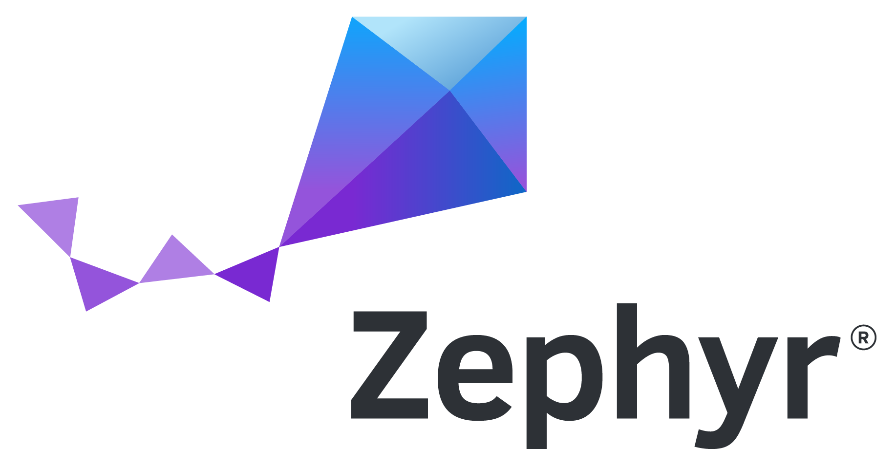

# Introduction

---

## Introduction

### Christian Hirsch

- TBD
- TBD
- **Experience:** TBD

### Jonas Remmert

- SMIGHT GmbH
- Developer for Low Power IoT products
- **Experience:** RTOS (Zephyr, FreeRTOS), NXP MCUX, hardware development

---

## Workshop Goals

**Theory:**
- Introduction to Zephyr RTOS
- Understanding the development ecosystem
- Exploring key features and subsystems

**Hands-on Sessions:**
1. Build and run samples on native_sim
2. Explore essential subsystems
3. Build a live BLE Application with the Nordic nRF54L15 DK Board

  

---

## Audience Check

- Have you used an RTOS before?
- Your experience with Zephyr?
- What are your goals for the Workshop?

---
---

## Open Source and Vendor-Neutral Governance

- Governed by the Linux Foundation
- Vendor-neutrality: fairness and interoperability
- Technical Steering Committee (TSC) and Working Groups (WG)
- Security and tooling (e.g. SBOM) as integral part
- **Alternative to vendor SDKs**

  
  
The Linux Foundation logo

---

## Zephyr for Products

**Examples**

- Overview: [zephyrproject.org/products-running-zephyr](https://www.zephyrproject.org/products-running-zephyr/)
- Wildlife Tracking and Protection (OpenCollar)
- Wind Turbines (Vestas)
- Irrigation (Gardena)
- Hearing Aid (Oticon)
- Wastewater Pump Monitoring (BeST Berliner Sensortechnik, German Railways - DB)
