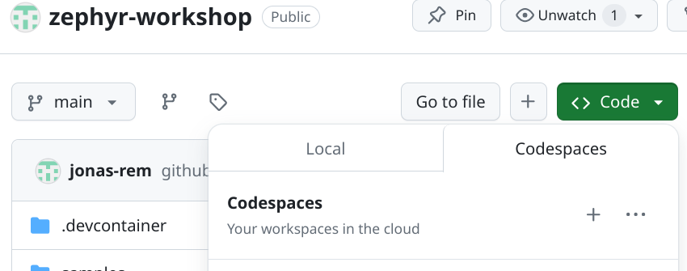
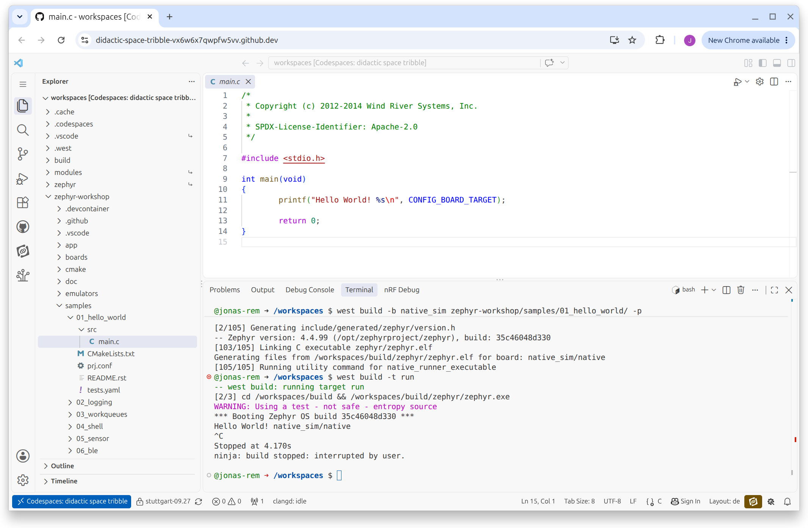

# Development Setup

---
layout: figure
figureCaption: Zephyr Getting Started Guide
figureUrl: ./images/Zephyr_getting_started.png
figureFootnoteNumber: 1
---

## Getting Started Guide

<Footnotes y="col">
  <Footnote :number=1><a href="https://docs.zephyrproject.org/latest/develop/getting_started/index.html">docs.zephyrproject.org/latest/develop/getting_started/index.html</a></Footnote>
</Footnotes>

---

## Starting a Cloud Development Environment

<div class="grid grid-cols-2 gap-4">

<div>

GitHub Codespaces

- Cloud hosted development environment based on devcontainers
- VS Code integration
- Workshop Samples, Zephyr Repo, tooling, SDK pre-setup in a pre-build container

</div>

<div class="flex flex-col items-center justify-center">
  
  <div class="text-xs text-center mt-2">Create a new Codespace</div>
</div>

</div>

---

## Active Instance of GitHub Codespace

<div class="flex flex-col items-center justify-center">
  
  <div class="text-xs text-center mt-2">Codespaces in a Browser Window</div>
</div>

---

## Recommendations from Experience

Virtual Machines in combination with embedded hardware can bring their own problems.

**Prioritize a local environment over a cloud environment**
- Hardware is better accessible
- Better integration of your own tools
- Check vendor tools that can enhance your Zephyr Dev Environment

---

## Hands-on 1 - Codespaces Setup

<div class="grid grid-cols-2 gap-4">

<div>

Start your own Codespaces Instance or Cloud IDE now!

[github.com/jonas-rem/zephyr-workshop](https://github.com/jonas-rem/zephyr-workshop)

[Cloud IDE by inovex](https://start.ide.training-zephyr.fra.ics.inovex.io/)

Setup will take a few minutes..

**Test your setup with the Hello World example:**

```shell
west build -b native_sim zephyr/samples/hello_world -p
west build -t run
```

</div>

<div class="flex flex-col items-center justify-center">
  
  <div class="text-xs text-center mt-2">Setup new Instance</div>
</div>

</div>

<Footnotes y="col">
  <Footnote :number=1><a href="https://start.ide.training-zephyr.fra.ics.inovex.io/">https://start.ide.training-zephyr.fra.ics.inovex.io/</a></Footnote>
</Footnotes>
