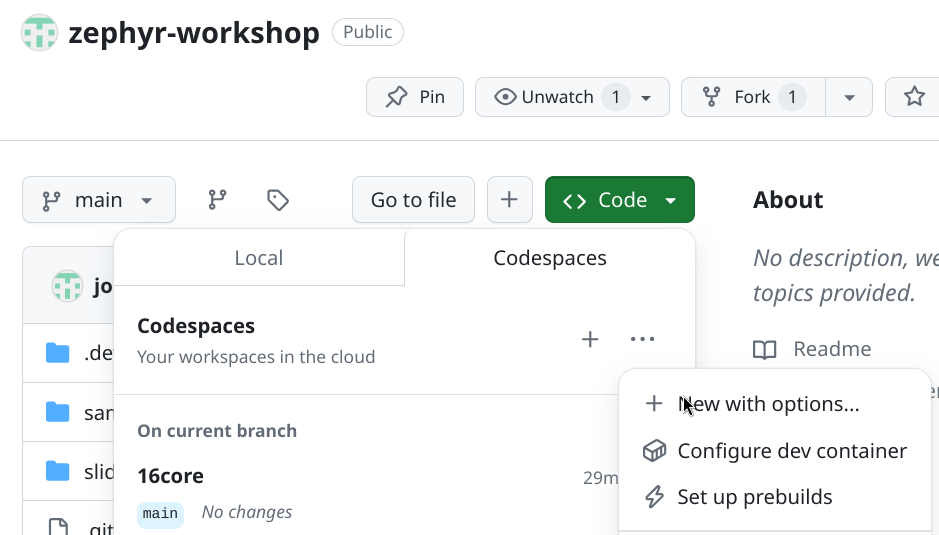

# Development Setup

---
layout: figure
figureCaption: Zephyr Getting Started Guide
figureUrl: ./images/Zephyr_getting_started.png
figureFootnoteNumber: 1
---

## Getting Started Guide

<Footnotes y="col">
  <Footnote :number=1><a href="https://docs.zephyrproject.org/latest/getting_started/index.html">docs.zephyrproject.org/latest/getting_started/index.html</a></Footnote>
</Footnotes>

---

## Codespaces Setup in the GitHub Repository (Backup)

<div class="grid grid-cols-2 gap-4">

<div>

**The Codespeces Setup serves as a Backup, in case of problems with your local
setup:**

[github.com/jonas-rem/zephyr-workshop](https://github.com/jonas-rem/zephyr-workshop)

Setup will take a few minutes..

**Test your setup with the Hello World example:**

```shell
west build -b native_sim zephyr/samples/hello_world -p
west build -t run
```

</div>

<div class="flex flex-col items-center justify-center">
  
  <div class="text-xs text-center mt-2">Setup new Instance</div>
</div>

</div>

<Footnotes y="col">
  <Footnote :number=1><strong>Recommendation:</strong> Use a 4-core setup instead of the 2-core default.</Footnote>
  <Footnote :number=2><strong>Note:</strong> You should have 120 core-hours per month free.</Footnote>
</Footnotes>
