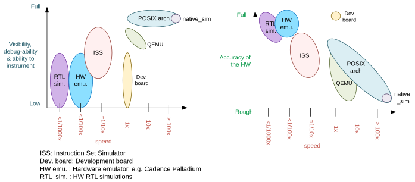

# Application Development

---
---

## IPC Mechanisms and Zephyr bus (Zbus)

<div class="grid grid-cols-2 gap-4">

<div>

**Classic**
- Mutexes, Semaphores
- Conditional Variables, Message Queues
- Polling API to wait for any out of multiple conditions

**Zbus**
- Comparable to D-Bus in Linux
- Many-to-many communication
- Simplifies thread synchronization

</div>

<div class="flex flex-col items-center justify-center">
  
  <div class="text-xs text-center mt-2">Zbus overview</div>
</div>

</div>

<Footnotes y="col">
  <Footnote :number="1"><a href="https://docs.zephyrproject.org/latest/services/zbus/index.html">docs.zephyrproject.org/latest/services/zbus</a></Footnote>
</Footnotes>

---
---

## Execution Targets

<div class="grid grid-cols-2 gap-4">

<div>

- **native_sim:** fast, reproducible, no real CPU
- **QEMU:** emulates the target CPU, slower
- **ISS:** cycle accurate, far slower than real time
- **Hardware:** exact, least visibility

</div>

<div class="flex flex-col items-center justify-center">
  
  <div class="text-xs text-center mt-2">Execution targets compared</div>
</div>

</div>

<Footnotes y="col">
  <Footnote :number="1"><a href="https://docs.zephyrproject.org/latest/boards/native/doc/arch_soc.html#comparison-with-other-options">docs.zephyrproject.org/latest/boards/native/doc/arch_soc.html</a></Footnote>
</Footnotes>

---
---

## native_sim

<div class="grid grid-cols-2 gap-4">

<div>

**Zephyr as a Linux executable**
- Deterministic
- `gdb`, sanitizers, coverage
- Emulators for buses, sensors, GPIO

</div>

<div>

**Host resources**
- Networking: host sockets or TAP
- Flash, EEPROM as host file
- CAN, Bluetooth, SDL display, audio

</div>

</div>

<Footnotes y="col">
  <Footnote :number="1"><a href="https://docs.zephyrproject.org/latest/boards/native/native_sim/doc/index.html">docs.zephyrproject.org/latest/boards/native/native_sim</a></Footnote>
</Footnotes>

---
---

## (1) Example Application

<div class="grid grid-cols-2 gap-4">

<div>

**Button**
- Debounced `sw0` press
- Publishes `button_event_ch`

**Sensor**
- Reads the HDC on `BUTTON_EVENT_0_PRESSED`
- Publishes lifecycle events on `sensor_event_ch`

**LED**
- On while a read is in progress

</div>

<div>

<div class="text-xs">

```text
button_event_ch                            sensor_event_ch
           │                                      │
           │             ┌──────────┐             │
           │◀─── event ──│  Button  │             │
           │             └──────────┘             │
           │             ┌──────────┐             │
           │─── event ──▶│  Sensor  │─── event ──▶│
           │             └──────────┘             │
           │             ┌──────────┐             │
           │─── event ──▶│   LED    │◀── event ───│
           │             └──────────┘             │
```

</div>

<div class="text-xs text-center mt-2">Button, sensor, and LED on typed channels</div>

</div>

</div>

---

## (1) Modular Development

<div class="grid grid-cols-2 gap-4">

<div>

- **General:** Code reuse, maintainability, readability
- **IPC:** Communication via Zbus
- **Context:** Each module is Kconfig-gated
- **Testing:** Each module has its own test

</div>

<div>

```text
samples/simulation/
├── CMakeLists.txt
├── Kconfig
├── prj.conf
├── tests.yaml
└── src
    ├── main.c
    ├── common
    │   ├── message_channel.h
    │   └── message_types.h
    └── modules
        ├── button/
        ├── led/
        └── sensor/
```

</div>

</div>

---

## (1) Starting the Modules

<div class="grid grid-cols-2 gap-4">

<div>

**Button:** `SYS_INIT`, before `main()`

**Sensor and LED:** static threads, init inside the thread

**Boot sequence:**
```text
Kernel
  ↓
drivers / zbus channels
  ↓
SYS_INIT (button)
  ↓
static threads (sensor, LED) and main()
```

</div>

<div>

**button.c:**
```c
SYS_INIT(button_init, APPLICATION,
         CONFIG_APP_SIM_BUTTON_INIT_PRIORITY);
```

**Boot log:**
```text
*** Booting Zephyr OS build v4.4.0 ***
<inf> app_simulation_button: Button initialized
<inf> app_simulation: App simulation booted
<inf> app_simulation_led: LED initialized
<inf> app_simulation_sensor: Sensor initialized
```

</div>

</div>

---

## (2) Build and Run

<div class="grid grid-cols-2 gap-4">

<div>

**Terminal 1:** app and logs
```text
$ west build -b native_sim samples/simulation -p
$ west build -t run
uart connected to pseudotty: /dev/pts/2
*** Booting Zephyr OS build v4.4.0 ***
<inf> app_simulation: App simulation booted
<dbg> app_simulation_led.set_output: LED ON
<dbg> app_simulation_sensor.perform_read: Read 1: 4059 mC, 40344 m%
<dbg> app_simulation_led.set_output: LED OFF
```

</div>

<div>

**Terminal 2:** shell, quit with `Ctrl+a Ctrl+x`
```text
$ picocom /dev/pts/2
uart:~$ button emulate
Emulated button press started
uart:~$ sensor latest
Sensor state: SUCCESS
Temperature: 4.059 C
Humidity: 40.344 %
```

</div>

</div>

---

## (3) Sensor Emulation

<div class="grid grid-cols-2 gap-4">

<div>

**Real driver, emulated chip**
- `ti,hdc` node on emulated `i2c0`
- Unmodified `ti_hdc.c` driver
- `emul_ti_hdc.c` answers I2C transfers
- Test sets values, injects faults

</div>

<div>

**Terminal 1:** sensor module alone, logs
```text
$ west build -b native_sim samples/simulation -p -- -DCONFIG_APP_SIM_BUTTON=n -DCONFIG_APP_SIM_LED=n
$ west build -t run
<dbg> app_simulation_sensor.perform_read: Read 1: 29999 mC, 55703 m%
```

**Terminal 2:** shell
```text
uart:~$ sensor_emul set temp 30
uart:~$ sensor read
uart:~$ sensor latest
Sensor state: SUCCESS
Temperature: 29.999 C
```

</div>

</div>

<Footnotes y="col">
  <Footnote :number="1"><a href="https://docs.zephyrproject.org/latest/hardware/emulator/index.html">docs.zephyrproject.org/latest/hardware/emulator</a></Footnote>
</Footnotes>

---

## (4) Testing Modules in Isolation

<div class="grid grid-cols-2 gap-4">

<div>

**Component test per module**
- Zephyr Test framework (`Ztest`)
- Co-located with the module
- Contract is the Zbus channel
- Hardware via `native_sim` emulators

**Test structure:**
```text
samples/simulation/src/modules/button/tests/
├── CMakeLists.txt
├── prj.conf
├── tests.yaml
└── src/
    └── test_button.c
```

</div>

<div>

**test_button.c:** press the emulated GPIO, observe `button_event_ch`.

<br>

**Running component tests:**
```bash
# One module
west twister -T samples/simulation/src/modules/button/tests --integration

# All modules
west twister -T samples/simulation/src/modules --integration

# Log on the console
west build -b native_sim samples/simulation/src/modules/button/tests
west build -t run
```

</div>

</div>

---

## (4) Testing Modules in Isolation - Results

<div class="grid grid-cols-2 gap-4 items-start">

<div>

**Run button test**

```bash
west twister -T samples/simulation/src/modules/button/tests --integration
```

**Key artifacts**
```text
twister-out/
└── native_sim_native/
    └── .../button/tests/
        └── app_simulation.component.button/
            ├── handler.log
            └── build.log
```

</div>

<div>

**Sample output** (handler.log)
```text
Running TESTSUITE button_test
START - test_press_publishes_event
 PASS - test_press_publishes_event
START - test_bounce_publishes_one_event
 PASS - test_bounce_publishes_one_event
START - test_repeated_presses_publish_repeated_events
 PASS - test_repeated_presses_publish_repeated_events
TESTSUITE button_test succeeded
SUITE PASS - 100.00% [button_test]:
  pass = 3, fail = 0, skip = 0, total = 3
```

</div>

</div>

---

## (5) Automated Testing with Twister

<div class="grid grid-cols-2 gap-4">

<div>

**Zephyr Test Runner (Twister)**
- `west twister` builds and runs tests
- Host (`native_sim`) or hardware
- Scenarios come from `tests.yaml`

</div>

<div>

**Integration run:**
```shell
west twister -T samples/simulation --integration
```

<br>

Boot, component, and `native_sim` end-to-end tests under `samples/simulation/`:

```text
app_simulation.basic
app_simulation.component.button
app_simulation.component.led
app_simulation.component.sensor
app_simulation.e2e.native_sim
```

`app_simulation.e2e.hil` is the same shell test on `reel_board`. It is not in the integration set.

</div>

</div>

---

## (5) End-to-End Test

<div class="grid grid-cols-2 gap-4">

<div>

**pytest drives the shell**
```python
def test_sensor_read_updates_latest_sample_and_led(shell):
    logs = output_with_logs(shell, "button emulate", drain=2.0)
    assert LED_ON in logs
    assert LED_OFF in logs

    lines = output(shell, "sensor latest")
    assert "Sensor state: SUCCESS" in "\n".join(lines)
```

Same script on `native_sim` and `reel_board`

</div>

<div>

**Run only this test**
```bash
west twister -T samples/simulation -s app_simulation.e2e.native_sim --integration
```

**twister_harness.log**
```text
#: uart:~$ button emulate
#: <dbg> app_simulation_led.set_output: LED ON
#: <dbg> app_simulation_led.set_output: LED OFF
#: sensor latest
#: Sensor state: SUCCESS
PASSED
```

</div>

</div>
