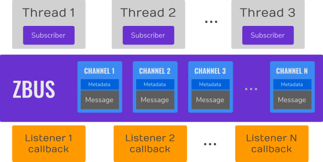
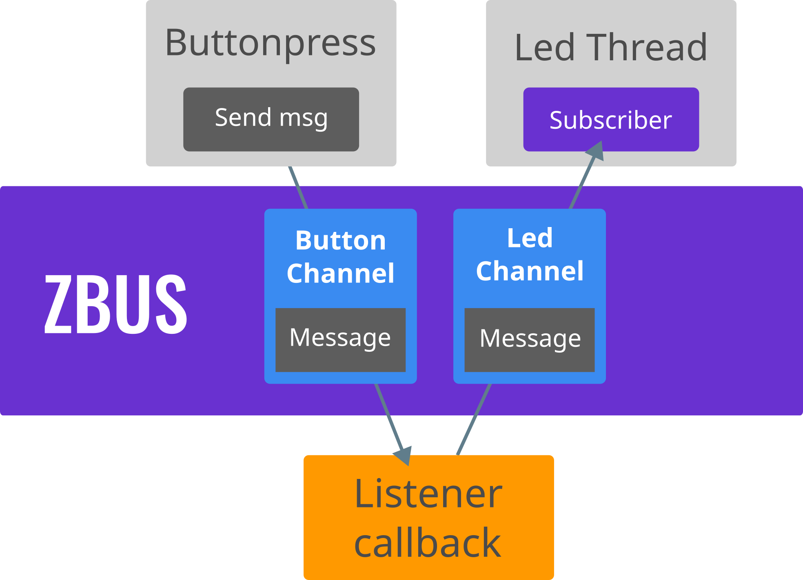

# Application Development

---
---

## IPC Mechanisms and Zephyr bus (zbus)

<div class="grid grid-cols-2 gap-4">

<div>

**Classic**
- Mutexes, Semaphores
- Conditional Variables, Message Queues
- Polling API to wait for any out of multiple conditions

**zbus**
- Comparable to D-Bus in Linux
- Many-to-many communication
- Simplifies thread synchronization

</div>

<div class="flex flex-col items-center justify-center">
  
  <div class="text-xs text-center mt-2">zbus overview</div>
</div>

</div>

<Footnotes y="col">
  <Footnote :number="1"><a href="https://docs.zephyrproject.org/latest/services/zbus/index.html">docs.zephyrproject.org/latest/services/zbus</a></Footnote>
</Footnotes>

---
---

## Example Application

<div class="grid grid-cols-2 gap-4">

<div>

**Button**
- Switch between system states (active, sleep)

**LED**
- Indicate system state
- Run in own thread for smooth animations

</div>

<div class="flex flex-col items-center justify-center">
  
  <div class="text-xs text-center mt-2">Minimal modular application with zbus</div>
</div>

</div>

---

## Modular Development

<div class="grid grid-cols-2 gap-4">

<div>

- **General:** Code reuse, maintainability, readability
- **IPC:** Communication via zbus
- **Context:** Each component can be controlled independently
- **Testing:** Components can be tested separately

</div>

<div>

```text
app/
├── CMakeLists.txt
├── Kconfig
├── prj.conf
└── src
    ├── common
    │   ├── CMakeLists.txt
    │   ├── message_channel.c
    │   └── message_channel.h
    ├── main.c
    └── components
        ├── button
        │   ├── button.c
        │   ├── CMakeLists.txt
        │   ├── Kconfig.button
        │   └── tests/
        └── led
            ├── led.c
            ├── CMakeLists.txt
            └── Kconfig.led
```

</div>

</div>

---

## Starting Components via System Initialization (SYS_INIT)

<div class="grid grid-cols-2 gap-4">

<div>

**Automatic Initialization**

- Runs after drivers/zbus, before `main()`
- Configurable priority

**Boot Sequence:**
```text
Kernel
  ↓
drivers/zbus
  ↓
SYS_INIT functions via priority
  ↓
Component threads
  ↓
main()
```
<v-click>

<br>

**Benefits:**

- Testability via Decoupled modules

</v-click>

</div>

<div>

<v-click>

**button.c:**
```c
SYS_INIT(init, APPLICATION,
         CONFIG_BUTTON_MODULE_INIT_PRIORITY);
```

**Boot Log:**
```text
*** Booting Zephyr OS build v4.3.0 ***
<inf> button_module: Set up button at gpio_emul pin 1
<inf> button_module: Button module started
<inf> sys_ctrl: System control started
<inf> led_module: LED module started
<inf> app: Main thread going to sleep.
```

</v-click>

</div>

</div>

---

## Testing the Components

<div class="grid grid-cols-2 gap-4">

<div>

**One test per component**
- Ztest, co-located with the component
- Talks to the component via zbus only
- Runs on `native_sim` with emulated hardware

```text
app/src/components/button/tests/
├── CMakeLists.txt
├── prj.conf
├── tests.yaml
└── src/
    └── test_button.c
```

More on testing: **Sim and Testing Track**

</div>

<div>

**Running the tests:**
```bash
# One component
west twister --integration \
  -T app/src/components/button/tests

# All components
west twister -T app/src/components --integration

# Log on the console
west build --board native_sim \
  app/src/components/button/tests
west build --target run
```

</div>

</div>

---

## Hands-on 4: Extend the Application - Cold-Chain Monitoring

<div class="grid grid-cols-2 gap-4">

<div>

1. **tempsense**
- Read temp, publish to `event_ch`

2. **temp_alert**
- Watch readings, emit alert if ≥5°C

3. **sensor_log**
- Record all events from ``event_ch``
- expose records via shell

Hints:
- Start with one of the components
- channels and existing components are already prepared
- Tests exist, use them to develop

</div>

<div>

<div class="text-xs">

```text
event_ch                                     sys_ctl_ch
   │               ┌────────────┐                  │
   │◀─── PRESSED ──│  Button    │                  │
   │               └────────────┘                  │
   │               ┌────────────┐                  │
   │──── PRESSED ─▶│  sys_ctrl  │── ACTIVE/SLEEP ─▶│
   │               └────────────┘                  │
   │               ┌────────────┐                  │
   │─ TEMP/ALERT ─▶│    LED     │◀─ ACTIVE/SLEEP ──│
   │               └────────────┘                  │

   │   ----------- New Components ------------     │
   │               ┌────────────┐                  │
   │◀──── TEMP ────│ tempsense  │◀─ ACTIVE/SLEEP ──│
   │               └────────────┘                  │
   │               ┌────────────┐                  │
   │◀─── ALERT ────│ temp_alert │                  │
   │──── TEMP ────▶│            │                  │
   │               └────────────┘                  │
   │               ┌────────────┐                  │
   │─ TEMP/ALERT ─▶│ sensor_log │◀─ ACTIVE/SLEEP ──│
   │               └────────────┘                  │
```

</div>

<div class="text-xs text-center mt-2">Cold-Chain Monitoring Architecture</div>


</div>

</div>

<Footnotes y="col">
  <Footnote :number="1">
    Full details at:
    <a href="https://jonas-rem.github.io/zephyr-workshop/src/task_app_extension.html">
      jonas-rem.github.io/zephyr-workshop/task_app_extension.html
    </a>
  </Footnote>
</Footnotes>
