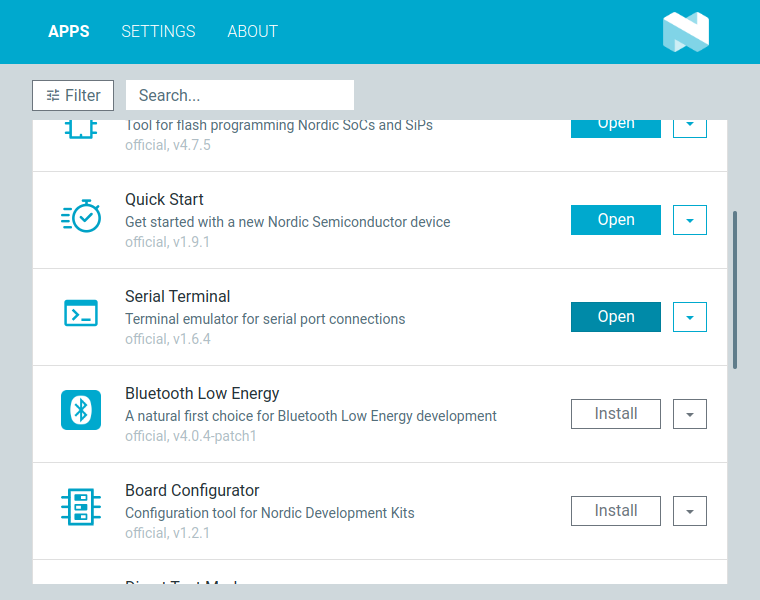
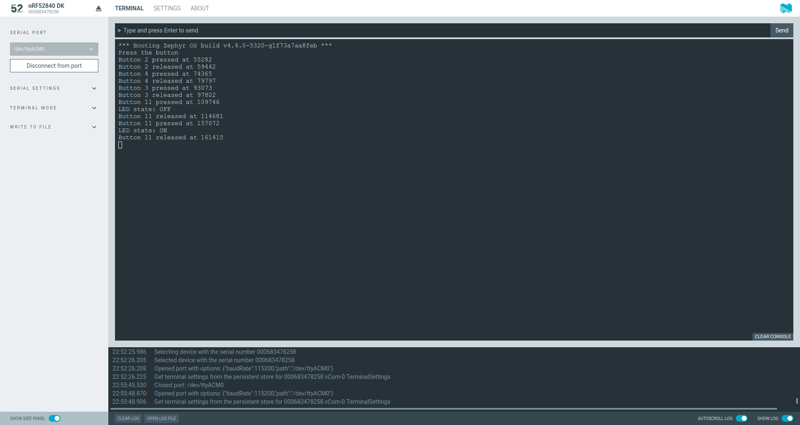
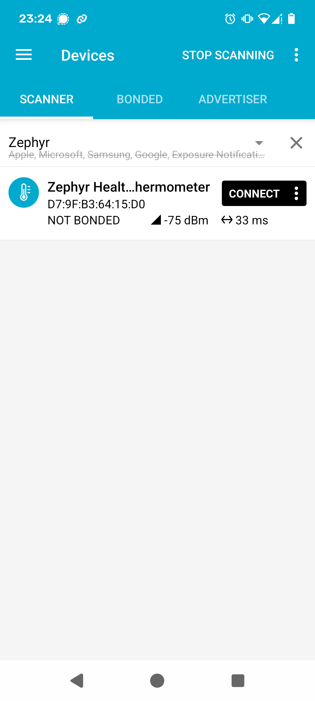
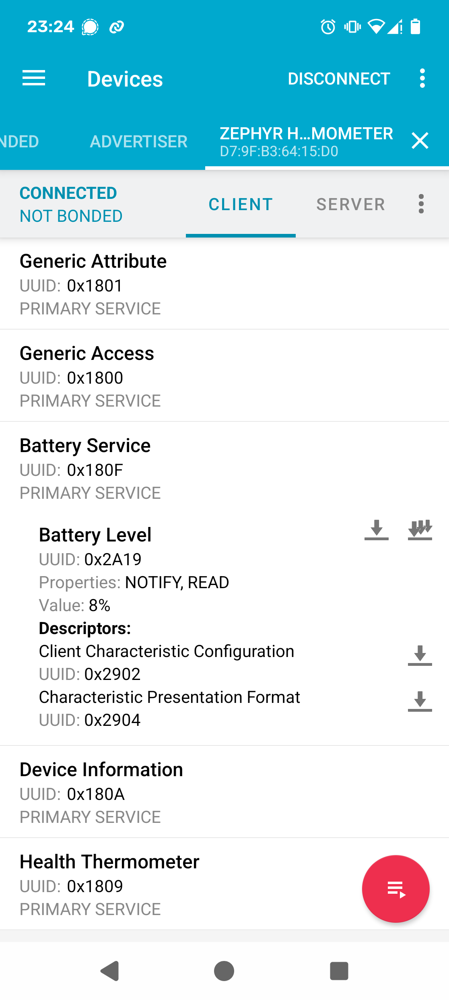
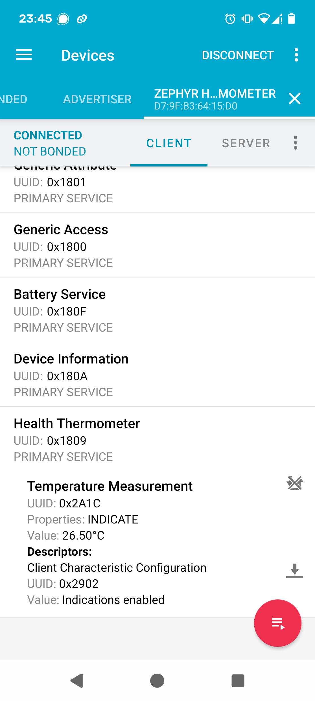

# Bluetooth Low Energy Demo

---

## nRF54L15 DK

<div class="grid grid-cols-2 gap-4">

<div>

Features
- nRF54L15 wireless SoC
- 2.4 GHz and NFC antennas
- J-Link programmer / debugger
- LEDs and buttons
- 8 MB external flash

</div>

<div class="flex flex-col items-center justify-center">
  
</div>

</div>

---

## Compiling

Compile the sources, e.g. `01_hello_world`, and use the nRF54L15 board by executing:

```shell
west build -b nrf54l15dk/nrf54l15/cpuapp samples/01_hello_world/ -p
```

The board is defined as follows:
- `nrf54l15dk`: the definition for the nRF54L15 DK board
- `nrf54l15`: variant using the nRF54L15 SoC
- `cpuapp`: processor / security settings / TF-M disabled
  - `cpuapp/ns`: enables TF-M, i.e., security by separation

---

## Flashing with west

Flash the sample from the console by executing

```shell
west flash
```

In case of an error like 

```shell
ERROR: The operation attempted is unavailable due to readback protection in
ERROR: your device. Please use --recover to unlock the device.
```

The readback protection is enabeled. Disable it by recovering the device with:

```shell
west flash --recover
```

---

## Flashing with nRF Connect for Desktop (backup)

In case you use the Codespace, you can use Nordic's nRF Connect for Desktop application to access and flash your device.

- Download from <a href="https://www.nordicsemi.com/Products/Development-tools/nrf-connect-for-desktop/download" about="_target">https://www.nordicsemi.com/Products/Development-tools/nrf-connect-for-desktop/download</a>

---

## nRF Connect

<div class="flex flex-col items-center justify-center">
  
Install and open the Programmer.
</div>

---

## nRF Connect - Programmer

<div class="flex flex-col items-center justify-center">
  
</div>

---

## Download the Binary (from Codespace)

<div class="flex flex-col items-center justify-center">
  
</div>

---

## 06_gpio Sample

<div class="grid grid-cols-2 gap-4">

<div>

**Description:**
- GPIO LED and Input Button Example

**Learn:**
- Define a GPIO
- Set a value on GPIO to switch on/off an LED
- Use Input API to handle button press

**Sample:**
- Switches on a LED and toggles it on button press

</div>

<div class="flex flex-col items-center justify-center">

```ini
CONFIG_GPIO=y
CONFIG_INPUT=y                                     
```

<div class="text-xs text-center mt-2">samples/06_gpio/prj.conf</div>

</div>

</div>
---

## 06_gpio Sample - Console Output

Compile and flash:

```shell
west build -b nrf54l15dk/nrf54l15/cpuapp samples/06_gpio -p
west flash
```

Start a serial console:

```shell
screen /dev/ttyACM1 115200
# quit with ctrl-a followed by \
```

Output:

```shell
*** Booting Zephyr OS build v4.4.0-5320-g1f73a7aa8feb ***
Press a button
Button 2 pressed at 161286
Button 2 released at 169322
Button 11 pressed at 237841
LED state: OFF
Button 11 released at 245559
Button 11 pressed at 346032
LED state: ON
Button 11 released at 353375
```

---

## 06_gpio Sample - Console Output via nRF Connect

<div class="flex flex-col items-center justify-center">
  
Install and open the Serial Terminal.
</div>

---

## 06_gpio Sample - Console Output via nRF Connect

<div class="flex flex-col items-center justify-center">
  
Selet the serial device (/dev/ttyACM1) and connect to port.
</div>

---

## 07_ble Sample

<div class="grid grid-cols-2 gap-4">

<div>

**Description:**
- BLE Peripheral device, temperature monitor<sup>1</sup>

**Learn:**
- BLE peripheral role and advertising
- Health Thermometer Service (HTS)

**Sample:**
- App to connect: nRF Connect for Mobile (Android, iOS)

</div>

<div class="flex flex-col items-center justify-center">

```ini
CONFIG_BT=y
CONFIG_LOG=y
CONFIG_BT_SMP=y
CONFIG_BT_PERIPHERAL=y
CONFIG_BT_DIS=y
CONFIG_BT_DIS_PNP=n
CONFIG_BT_BAS=y
CONFIG_BT_DEVICE_NAME="Zephyr Health Thermometer"
CONFIG_BT_DEVICE_APPEARANCE=768
CONFIG_CBPRINTF_FP_SUPPORT=y
CONFIG_SENSOR_SHELL=y
CONFIG_SENSOR_INFO=y
CONFIG_I2C_SHELL=y
```

<div class="text-xs text-center mt-2">samples/06_ble/prj.conf</div>

</div>

</div>

<Footnotes y="col">
  <Footnote :number=1>Equivalent in the Zephyr main Repository: zephyr/samples/bluetooth/peripheral_ht.</Footnote>
</Footnotes>

---

## 07_ble Sample - Console Output

Compile and flash:

```shell
west build -b nrf54l15dk/nrf54l15/cpuapp samples/07_ble -p
west flash
```

Start a serial console:

```shell
screen /dev/ttyACM1 115200 # quit with ctrl-a followed by \

*** Booting Zephyr OS build v4.4.0-5389-g7a263c0723ad ***
[00:00:00.253,723] <inf> bt_hci_core: HW Platform: Nordic Semiconductor (0x0002)
[00:00:00.253,753] <inf> bt_hci_core: HW Variant: nRF52x (0x0002)
[00:00:00.253,753] <inf> bt_hci_core: Firmware: Standard Bluetooth controller (0x00) Version 4.4 Build 99
[00:00:00.254,577] <inf> bt_hci_core: HCI transport: Controller
[00:00:00.254,699] <inf> bt_hci_core: Identity: D7:9F:B3:64:15:D0 (random)
[00:00:00.254,730] <inf> bt_hci_core: HCI: version 5.4 (0x0d) revision 0x0000, manufacturer 0x05f1
[00:00:00.254,730] <inf> bt_hci_core: LMP: version 5.4 (0x0d) subver 0xffff
Bluetooth initialized
temp device is 0x245e0, name is temp@4000c000
Advertising successfully started
Connected
temperature is 26.5C
Indication success
Indication complete
```

---

## 07_ble Sample - Smartphone Output

Download and install the nRF Connect for Mobile App:

<div class="grid grid-cols-2 gap-4">

<div class="flex flex-col items-center justify-center">
  
<a href="https://apps.apple.com/gb/app/nrf-connect-for-mobile/id1054362403" target="_blank">iPhone</a>
</div>

<div class="flex flex-col items-center justify-center">
  
<a href="https://play.google.com/store/apps/details?id=no.nordicsemi.android.mcp" target="_blank">Android</a>
</div>

</div>

---

## 07_ble Sample - Smartphone Output

<div class="grid grid-cols-3 gap-4">

<div class="flex flex-col items-center justify-center">
  
Scan for devices
</div>

<div class="flex flex-col items-center justify-center">
  
Read (simulated) battery value
</div>

<div class="flex flex-col items-center justify-center">
  
Read temperature value
</div>

</div>
