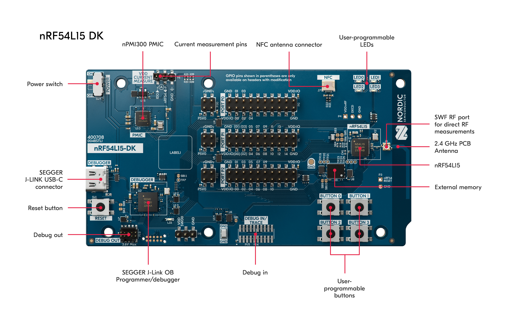
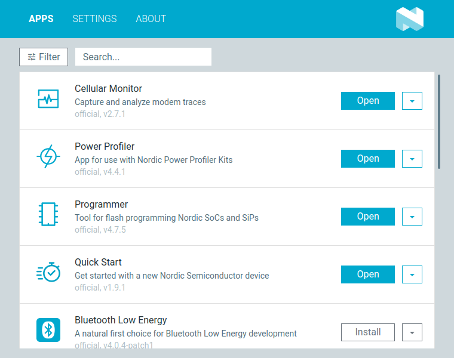
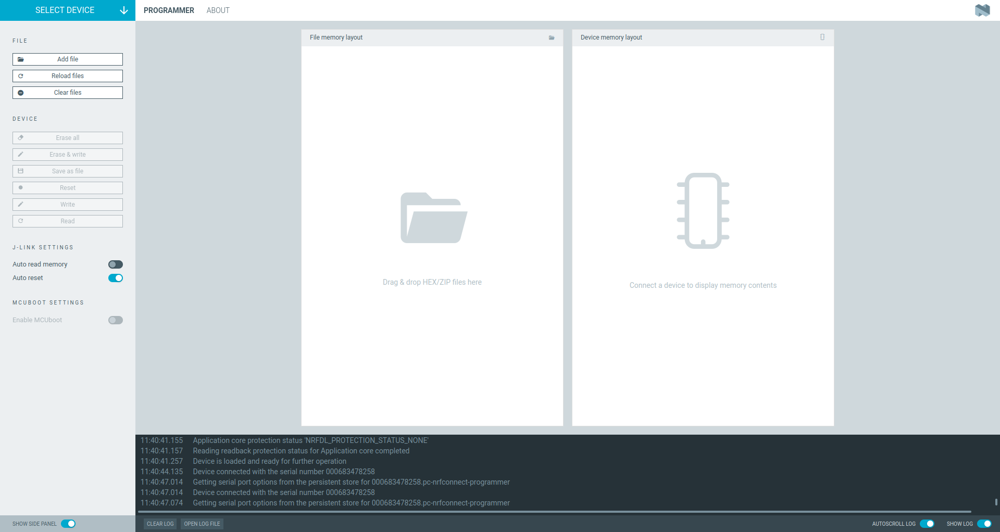
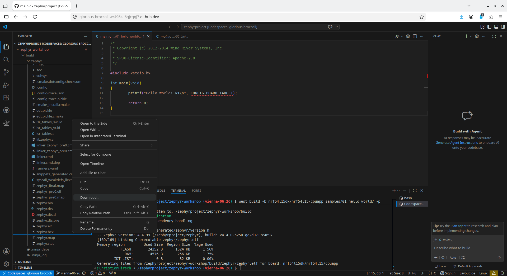

# Bluetooth Low Energy Demo

---

## nRF54L15 DK

<div class="grid grid-cols-2 gap-4">

<div>

Features
- nRF54L15 wireless SoC
- 2.4 GHz and NFC antennas
- J-Link programmer / debugger
- LEDs and buttons
- 8 MB external flash

</div>

<div class="flex flex-col items-center justify-center">
  
</div>

</div>

---

## Compiling

Compile the sources, e.g. `01_hello_world`, and use the nRF54L15 board by executing:

```shell
west build -b nrf54l15dk/nrf54l15/cpuapp samples/01_hello_world/ -p
```

The board is defined as follows:
- `nrf54l15dk`: the definition for the nRF54L15 DK board
- `nrf54l15`: variant using the nRF54L15 SoC
- `cpuapp`: processor / security settings / TF-M disabled
  - `cpuapp/ns`: enables TF-M, i.e., security by separation

---

## Flashing with west

Flash the sample from the console by executing

```shell
west flash
```

In case of an error like 

```shell
ERROR: The operation attempted is unavailable due to readback protection in
ERROR: your device. Please use --recover to unlock the device.
```

The readback protection is enabeled. Disable it by recovering the device with:

```shell
west flash --recover
```

---

## Flashing with nRF Connect for Desktop (backup)

In case you use the Codespace, you can use Nordic's nRF Connect for Desktop application to access and flash your device.

- Download from <a href="https://www.nordicsemi.com/Products/Development-tools/nrf-connect-for-desktop/download" about="_target">https://www.nordicsemi.com/Products/Development-tools/nrf-connect-for-desktop/download</a>

---

## nRF Connect

<div class="flex flex-col items-center justify-center">
  
Install and open the Programmer.
</div>

---

## nRF Connect - Programmer

<div class="flex flex-col items-center justify-center">
  
</div>

---

## Download the Binary (from Codespace)

<div class="flex flex-col items-center justify-center">
  
</div>

---

## 06_gpio Sample

<div class="grid grid-cols-2 gap-4">

<div>

**Description:**
- GPIO LED and Input Button Example

**Learn:**
- Define a GPIO
- Set a value on GPIO to switch on/off an LED
- Use Input API to handle button press

**Sample:**
- Switches on a LED and toggles it on button press

</div>

<div class="flex flex-col items-center justify-center">

```ini
CONFIG_GPIO=y
CONFIG_INPUT=y                                     
```

<div class="text-xs text-center mt-2">samples/06_gpio/prj.conf</div>

</div>

</div>
---

## 06_gpio Sample - Console Output

```shell
*** Booting Zephyr OS build v4.4.0-5320-g1f73a7aa8feb ***
Press a button
Button 2 pressed at 161286
Button 2 released at 169322
Button 11 pressed at 237841
LED state: OFF
Button 11 released at 245559
Button 11 pressed at 346032
LED state: ON
Button 11 released at 353375
```
