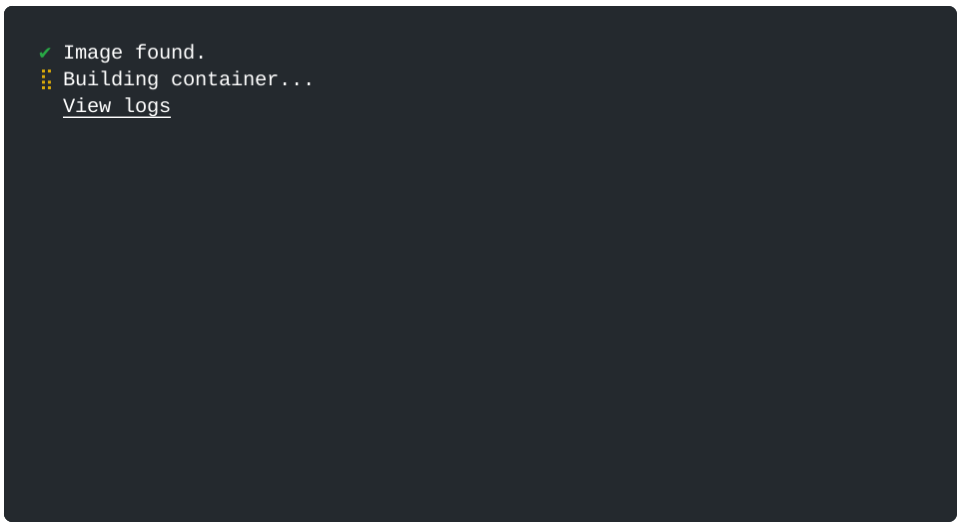

Workshop Setup
==============

For detailed setup instructions how to setup Zephyr on your machine, refer the
`Zephyr Getting Started Guide
<https://docs.zephyrproject.org/latest/getting_started/index.html>`_.

Starting the Dev Environment
----------------------------

This `zephyr-workshop <https://github.com/jonas-rem/zephyr-workshop>`_
repository, has GitHub codespaces configured. This provides a cloud-hosted
development environment based on devcontainers with VSode integration. In order
to start it in your browser follow the steps:

.. note:: **Codespace Configuration Tip**

   - Use a 4-core setup instead of the 2-core default for better performance
   - You should have 120 core-hours per month free on GitHub Codespaces

1. Navigate to the repository on GitHub: https://github.com/jonas-rem/zephyr-workshop
2. Click the green "Code" button
3. Select the "Codespaces" tab
4. Click "Create codespace on main"

.. image:: ../slides/public/images/codespaces_how_to_start.png
   :alt: Create a new Codespace
   :align: center

The setup will take a few minutes as it installs all required dependencies.

Once ready, the Codespace opens in a browser window:

.. image:: ../slides/public/images/codespaces_open.png
   :alt: Codespaces in a Browser Window
   :align: center

Testing the Codespace Setup
~~~~~~~~~~~~~~~~~~~~~~~~~~~

Once your Codespace is ready, test it with the Hello World example.

.. code-block:: console

   host:~$ west build -b native_sim zephyr/samples/hello_world -p
     building..
   host:~$ west build -t run
     *** Booting Zephyr OS build v4.3.0 ***
     Hello World! native_sim/native

This output confirms that the Zephyr build was successfull. The command ``west
build -t run`` executes ``build//zephyr/zephyr.exe``. Zephyr Version
(``v4.3.0``) as well as the Board (``native_sim/native``) is printed.
