Instrumentation & Tracing
=========================

Zephyr provides two complementary subsystems for analyzing runtime behavior.
While both extract data from a running system, they operate at different
levels and answer different questions.

Comparison
----------

.. table:: Tracing vs Instrumentation
   :widths: auto

   +---------------+--------------------------------------+------------------------------------------+
   | Feature       | Tracing                              | Instrumentation                          |
   +===============+======================================+==========================================+
   | Core Question | *When* did it happen? (Sequence &    | *What functions executed?* (Call graph & |
   |               | Timing)                              | flow)                                    |
   +---------------+--------------------------------------+------------------------------------------+
   | Level         | RTOS-aware (high-level events)       | Compiler-level (all functions)           |
   +---------------+--------------------------------------+------------------------------------------+
   | Data Type     | Discrete Events (Context switch, IRQ | Function entry/exit events with          |
   |               | entry, Semaphore take)               | timestamps                               |
   +---------------+--------------------------------------+------------------------------------------+
   | Visual Output | Timeline / Gantt Chart (e.g.,        | Function call tree / Perfetto            |
   |               | TraceCompass, Perfetto)              |                                          |
   +---------------+--------------------------------------+------------------------------------------+
   | Manual Setup  | Minimal (Kconfig only)               | None (automatic compiler insertion)      |
   | Required      |                                      |                                          |
   +---------------+--------------------------------------+------------------------------------------+
   | Overhead      | Low to Medium                        | Higher (every function call)             |
   +---------------+--------------------------------------+------------------------------------------+

When to Use What
----------------

Use the **Tracing** subsystem (`subsys/tracing`_) when you need RTOS-aware event
tracing with structured event APIs. Best for tracking kernel events like thread
switches, semaphore operations, and IRQ handling with minimal overhead. Supports
backends like CTF, SysView, and Percepio Tracealyzer.

Use the **Instrumentation** subsystem (`subsys/instrumentation`_) when you need a
detailed view of function-level execution flow without adding manual trace
points. The compiler automatically instruments function entry/exit using GCC's
``-finstrument-functions``, making this ideal for capturing complete call graphs
and understanding code flow at the function level.

Tracing
-------

Tracing records the exact sequence of executable events as they occur on the
timeline. It preserves the temporal relationship between different parts of the
system.

**Useful for:**

* **Debugging Concurrency:** Visualizing race conditions, deadlocks, and
  priority inversions between threads.
* **Latency Analysis:** Measuring the exact duration an Interrupt Service
  Routine (ISR) blocks critical threads.
* **Flow Verification:** Confirming that the sequence of hardware interactions
  (e.g., "SPI transaction starts" -> "GPIO toggles") happens in the correct
  order.

Instrumentation
---------------

Instrumentation captures function entry and exit events automatically through
compiler instrumentation. Unlike tracing which focuses on RTOS events,
instrumentation records virtually every function call without code changes.

**Useful for:**

* **Complete Call Graphs:** Reconstructing the full function call tree to
  understand complex execution flows.
* **Automated Analysis:** Capturing function traces without manually adding
  trace points throughout the codebase.
* **Detailed Flow Analysis:** Understanding the exact path taken through the
  code at the function level.

**Important Considerations:**

* Higher overhead than tracing (instruments every function)
* Requires GCC with ``-finstrument-functions``
* Increases code size and stack usage
* Use trigger/stopper functions to limit recording to specific code regions
* Exclude performance-critical functions via Kconfig to reduce overhead

Tracing Example with Trace Compass
-----------------------------------

This example uses the `tracing_sample`_ from the Zephyr tracing subsystem to
generate a CTF trace and visualize it in Trace Compass.

.. note::

   Trace Compass needs both the trace data file and the metadata file that
   describes the CTF format. The metadata file is located at
   ``zephyr/subsys/tracing/ctf/tsdl/metadata`` in the Zephyr source tree.
   Both files must be in the same directory to open the trace.

Build and run the tracing sample:

.. code-block:: console

   host:~$ west build -b native_sim samples/subsys/tracing -- \
               -DCONF_FILE=prj_native_ctf.conf
   host:~$ ./build/zephyr/zephyr.exe -trace-file=traces/channel0_0

After the run completes (or is cancelled), the ``traces/`` directory contains
the trace data file.

Open Traces
^^^^^^^^^^^

`Trace Compass <https://eclipse.dev/tracecompass/>`_ is an open-source trace
viewer from the Eclipse Foundation. It can visualize CTF traces as timelines
and Gantt charts.

To make Trace Compass aware of Zephyr-specific events (thread switches, ISRs,
semaphore operations), you need to install the Zephyr parser from the
`zephyr-tracecompass-parser <https://github.com/ostrodivski/zephyr-tracecompass-parser>`_
repository. The following steps guide you through the setup process. Once setup,
you can view all Zephyr traces (generated by a `native_sim` run or via
hardware).

1. Install Scripting Support
~~~~~~~~~~~~~~~~~~~~~~~~~~~~

Trace Compass requires scripting extensions to run the Zephyr parser. Install
the following modules via **Tools > Add-ons...**:

- Trace Compass Scripting (Incubation)
- Trace Compass Scripting Python (Incubation)

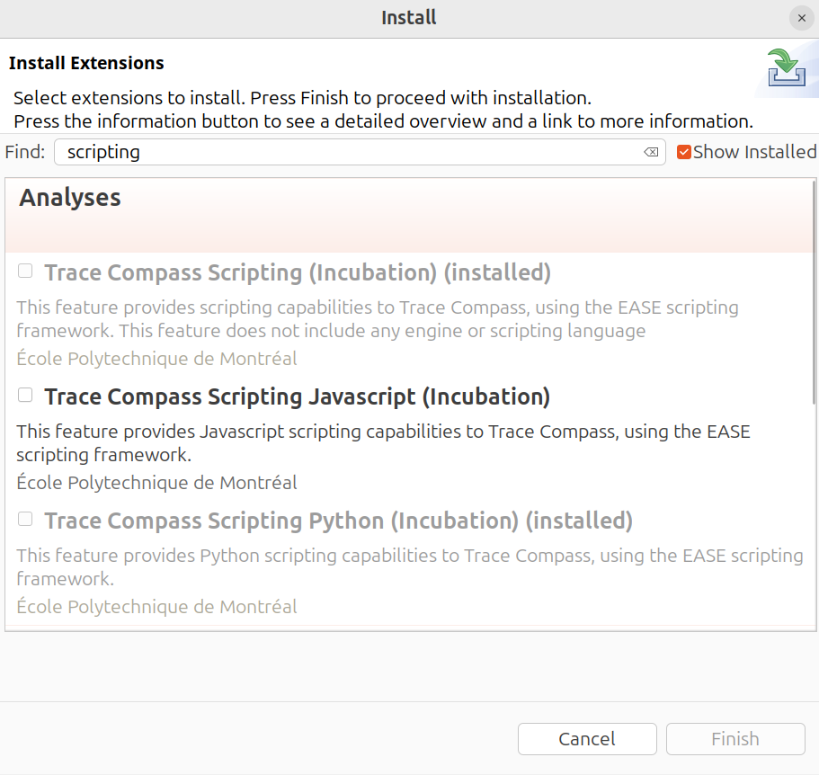

   Installing Trace Compass Scripting and Python modules

2. Configure Script Path
~~~~~~~~~~~~~~~~~~~~~~~~

Clone the parser repository and import the script:

.. code-block:: console

   host:~$ git clone https://github.com/ostrodivski/zephyr-tracecompass-parser.git

Configure the Python interpreter path in **Preferences > Scripting >
Python Scripting (using Py4J)**. Set it to your Python 3 executable:

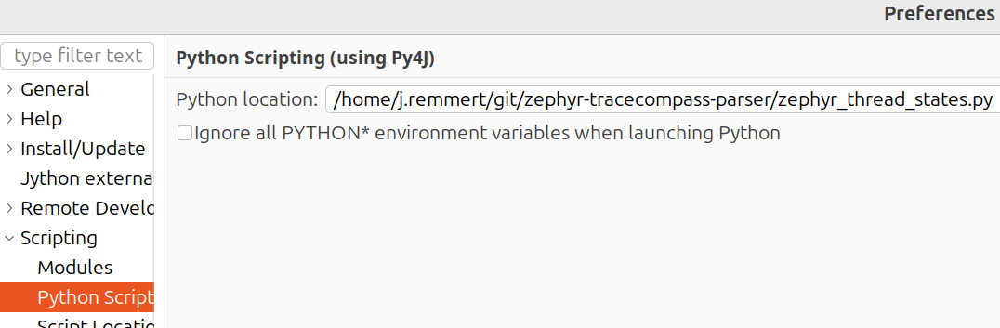

   Setting the Python interpreter path

3. Import the Parser Script
~~~~~~~~~~~~~~~~~~~~~~~~~~~

In Trace Compass, right-click in the Project Explorer and select
**Open Trace...**:

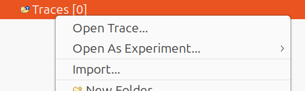

   Opening the file browser to import the parser script

Navigate to the cloned repository and select ``zephyr_thread_states.py``:

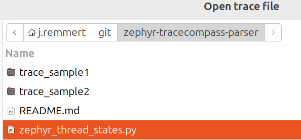

   Selecting the Zephyr parser script

The script will appear in your Traces folder:

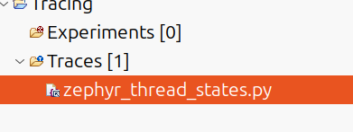

   Parser script successfully imported

4. Import the CTF Trace
~~~~~~~~~~~~~~~~~~~~~~~

Right-click in the Project Explorer and select **Import...**:

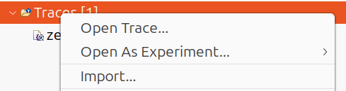

   Import menu to add CTF trace files

In the Trace Import dialog, select your ``traces/`` directory containing both
``channel0_0`` (trace data) and ``metadata`` (CTF format description) files:

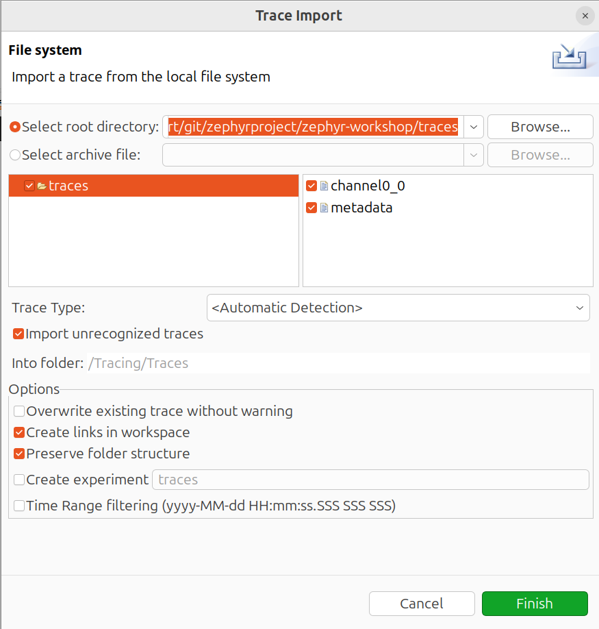

   Importing the traces directory with channel0_0 and metadata files

5. Open the Trace
~~~~~~~~~~~~~~~~~

Before running the parser, you must explicitly open the trace file. In the
Project Explorer, right-click on the imported trace (e.g., ``channel0_0``) and
select **Open**:

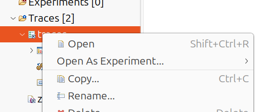

   Right-click and select Open to open the trace

Now the events in the `traces` field should already be visible.

6. Run the Parser
~~~~~~~~~~~~~~~~~

Run the ``zephyr_thread_states.py`` script to enable Zephyr-specific event
parsing. Right-click the script and select **Run As... > Ease Script**:

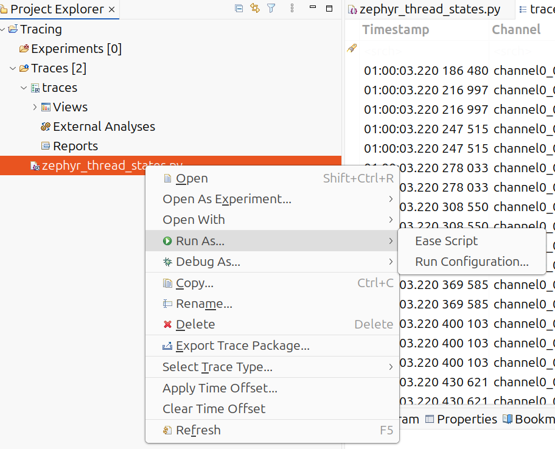

   Running the zephyr_thread_states.py script

.. note::

   If the script fails with "Could not setup Python engine" or Py4J errors,
   try running with **Jython** instead:
   **Run As... > Run Configuration... > Jython**

7. View the Results
~~~~~~~~~~~~~~~~~~~

After running the script, a new **Zephyr Comprehensive Timeline** tab will open,
showing thread states, interrupts, and kernel events:

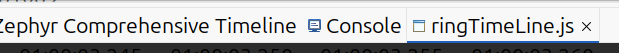

   Zephyr Comprehensive Timeline view opened

The trace visualization shows thread scheduling, ISR execution, and GPIO
operations in both table and Gantt chart views. The trace is from a
``nrf52840dk`` evaluation board where the traces have been collected via usb
(see example below):

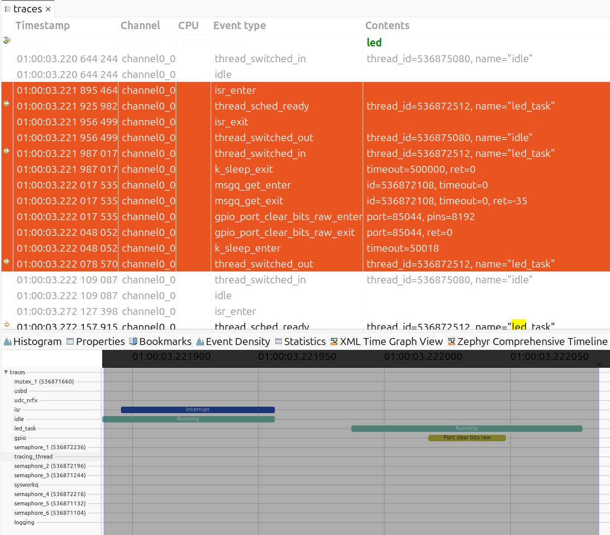

   Trace Compass showing thread scheduling, ISR execution, and GPIO operations

The selected trace and marked events above represent the toggle of the LED on a
`Nordic nRF52840dk` board with the application example.

native_sim
^^^^^^^^^^

The workshop ``app`` includes ``prj_native_ctf.conf``:

Build and run:

.. code-block:: console

   host:~$ west build -b native_sim app -p -- -DEXTRA_CONF_FILE=prj_native_ctf.conf
   host:~$ mkdir -p traces
   host:~$ ./build/zephyr/zephyr.exe -trace-file=traces/channel0_0

Stop the application after a few seconds. The ``traces/`` directory now contains
the trace data file.

HW via USB
^^^^^^^^^^

For physical boards like the nrf52840dk, the USB backend provides a clean way
to capture CTF traces without interfering with the console UART. The board
enumerates as a USB device and streams trace data to the host.

The workshop ``app`` includes ``prj_usb_ctf.conf``. Simply enable the
``TRACING_USB_MODULE`` to automatically configure USB device initialization:

Build and flash to the board:

.. code-block:: console

   host:~$ west build -b nrf52840dk/nrf52840 app -p -- -DEXTRA_CONF_FILE=prj_usb_ctf.conf
   host:~$ west flash

Connect the board's USB port to your host. The board will enumerate as a USB
device.

**USB Permissions (Linux):**

On Linux, accessing USB devices requires proper permissions. The workshop
includes a udev rule file at ``util/50-zephyr-tracing.rules``. Install it to
allow non-root access:

.. code-block:: console

   host:~$ sudo cp util/50-zephyr-tracing.rules /etc/udev/rules.d/
   host:~$ sudo udevadm control --reload-rules
   host:~$ sudo udevadm trigger

**Finding the VID and PID:**

Use ``lsusb`` to find your device's Vendor ID (VID) and Product ID (PID):

.. code-block:: console

   host:~$ lsusb
   Bus 003 Device 082: ID 2fe3:0001 NordicSemiconductor USBD sample

The format is ``ID VID:PID``. In this example:

- VID = ``0x2FE3`` (Nordic Semiconductor)
- PID = ``0x0001`` (Zephyr USB device)

These values are configured in the Zephyr USB device stack and may vary by
board.

**Capture the trace data:**

.. code-block:: console

   host:~$ python3 ../zephyr/scripts/tracing/trace_capture_usb.py -v 0x2FE3 -p 0x0001 -o traces/channel0_0

Let it run for some time, then press :kbd:`CTRL+C` to stop. The ``traces/``
directory now contains the trace data file and can be opened in Trace Compass.

HW via J-Link RTT + SystemView
------------------------------

For physical boards like the ``nrf52840dk``, the SEGGER SystemView backend
provides real-time tracing via J-Link RTT (Real-Time Transfer). SystemView
visualizes thread scheduling, interrupts, and kernel events with minimal
overhead.

.. note::

   SEGGER SystemView requires a license for commercial applications. For
   educational and evaluation purposes, it is free to use.

The workshop ``app`` includes ``prj_sysview_rtt.conf``:

Build and flash to the board:

.. code-block:: console

   host:~$ west build -b nrf52840dk/nrf52840 app -p -- -DEXTRA_CONF_FILE=prj_sysview_rtt.conf
   host:~$ west flash

**SystemView Software Installation:**

Download and install SEGGER SystemView from the `SEGGER website
<https://www.segger.com/downloads/systemview/>`_. Ensure the J-Link software
is also installed and ``JLinkExe`` is in your system PATH.

**Stream the trace data:**

1. Connect the ``nrf52840dk`` to your host via USB (J-Link debugger)
2. Open SystemView and select **Target > Recorder Configuration**
3. Set the interface to **RTT** and device to **nRF52840_xxAA**
4. Click **Start** to begin recording
5. SystemView should show a stream of the trace, which you can stop at any time

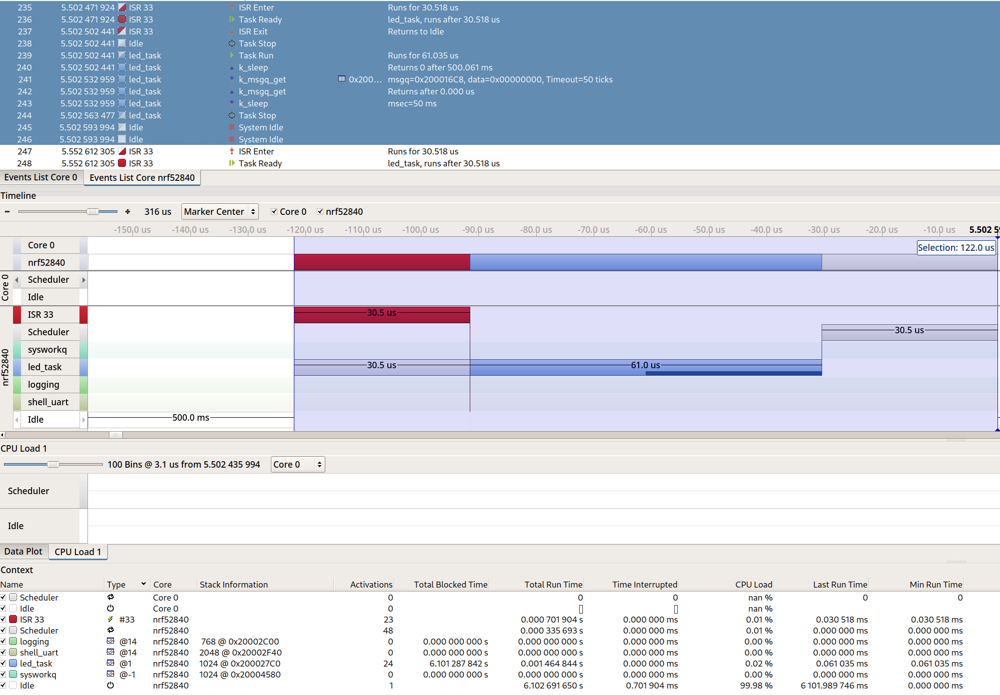

   SystemView with thread scheduling, ISR execution, and kernel events

The screenshot below shows a typical SystemView trace from the example app
running on the nrf52840dk. The timeline displays thread execution, interrupts,
and kernel events with precise timing information:

References
----------

.. _subsys/tracing: https://docs.zephyrproject.org/latest/services/tracing/index.html
.. _tracing_sample: https://docs.zephyrproject.org/latest/samples/subsys/tracing/README.html
.. _subsys/instrumentation: https://docs.zephyrproject.org/latest/services/instrumentation/index.html
.. _zephyr_tracecompass_parser: https://github.com/ostrodivski/zephyr-tracecompass-parser

- `Tracing subsystem documentation <subsys/tracing_>`_
- `Tracing sample <tracing_sample_>`_
- `Instrumentation subsystem documentation <subsys/instrumentation_>`_
- `Zephyr Trace Compass Parser <zephyr_tracecompass_parser_>`_
